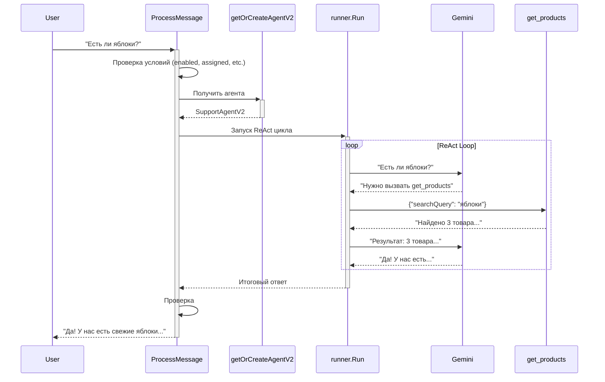

# 🤖 ADK Agent для EcoChat

Реализация автоответчика на базе **Google ADK-Go** (Agent Development Kit) с поддержкой multi-turn reasoning, автоматического управления памятью и встроенной телеметрией.

## 📋 Содержание

- [Что это и зачем](#что-это-и-зачем)
- [Установка](#установка)
- [Быстрый старт](#быстрый-старт)
- [Архитектура](#архитектура)
- [Ключевые преимущества](#ключевые-преимущества)
- [Инструменты (Tools)](#инструменты-tools)
- [Эскалация](#эскалация)
- [Тестирование](#тестирование)
- [Сравнение со старым автоответчиком](#сравнение-со-старым-автоответчиком)
- [Troubleshooting](#troubleshooting)

## Что это и зачем

**Google ADK-Go** - это фреймворк для создания AI агентов с multi-turn reasoning (ReAct pattern). Вместо одного запроса к LLM, агент может делать несколько итераций:

```
Пользователь: "Есть ли у вас яблоки? Если да, сколько они стоят и когда доставите?"

Старый автоответчик:
  ❌ Делает 1 tool call
  ❌ Возвращает частичный ответ

ADK Агент:
  ✅ Turn 1: Вызывает get_products("яблоки")
  ✅ Turn 2: Анализирует результаты
  ✅ Turn 3: Вызывает get_store_info("delivery")
  ✅ Turn 4: Комбинирует всю информацию и отвечает
```

### Зачем переходить?

1. **Multi-turn reasoning** - агент может делать несколько запросов для решения сложных вопросов
2. **Меньше кода** - 400 строк вместо 800+ в старом автоответчике
3. **Встроенные возможности** - память, телеметрия, обработка ошибок из коробки
4. **Простота добавления tools** - 10-20 строк вместо 50-100

## Установка

Зависимости уже установлены:

```bash
go get google.golang.org/adk@v0.1.0
```

Проверка:

```bash
go test ./adkagent -v
```

## Быстрый старт

### 1. Включение через переменные окружения

```bash
# .env или export
export USE_ADK_AGENT=true
export GEMINI_API_KEY=your_api_key_here
```

### 2. Использование в коде

```go
import (
    "github.com/egor/ecochatserver/adkagent"
    "github.com/egor/ecochatserver/llm"
)

func main() {
    ctx := context.Background()
    cfg := llm.GetDefaultConfig()

    if adkagent.ShouldUseADK() {
        // ✨ Новый ADK агент
        ar, err := adkagent.InitADKAutoResponder(ctx, cfg)
        if err != nil {
            log.Fatal(err)
        }
        log.Println("✅ Используется ADK-агент")
    } else {
        // Старый автоответчик
        ar, err := llm.NewAutoResponderWithConfig(cfg)
        if err != nil {
            log.Fatal(err)
        }
        log.Println("✅ Используется старый автоответчик")
    }

    // Оба агента совместимы с одним интерфейсом!
    response, err := ar.ProcessMessage(ctx, chat, message)
}
```

### 3. MockLLM для разработки

Без `GEMINI_API_KEY` автоматически используется **MockLLM**:

```
[AGENT] GEMINI_API_KEY не установлен, используем тестовый режим
```

Это позволяет разрабатывать и тестировать без API ключа!

## Архитектура

### Структура файлов

```
adkagent/
├── README.md                    # Эта документация
├── init.go                      # Точка входа (InitADKAutoResponder)
├── gemini_provider.go           # Gemini модель + MockLLM
├── support_agent_v2.go          # Основной агент с runner.Runner
├── adk_autoresponder_v2.go      # Обёртка для совместимости
├── types.go                     # Общие типы (EscalationState, etc.)
├── example_test.go              # Unit тесты
└── integration_test.go          # Интеграционные тесты
```

### Компоненты

```
ADKAutoResponderV2
  ├─ StoreClient (для работы с БД)
  ├─ Config (настройки автоответчика)
  ├─ Escalations (карта эскалаций)
  │
  ├─ SupportAgentV2 (для авторизованных)
  │   ├─ runner.Runner (управляет ReAct циклом)
  │   ├─ session.Service (память разговора)
  │   ├─ gemini.Model (Gemini 2.5-flash)
  │   └─ Tools:
  │       ├─ get_products
  │       └─ get_store_info
  │
  └─ SupportAgentV2 (для неавторизованных)
      └─ ... (та же структура)
```

### Процесс обработки сообщения



## Ключевые преимущества

### 1. Multi-turn Reasoning (ReAct Pattern)

**Что это:** Агент может делать несколько запросов к инструментам для ответа на один сложный вопрос.

**Пример:**

```
Вопрос: "У вас есть помидоры? Сколько стоят и когда доставите?"

Старый код (1 tool call):
  User: "У вас есть помидоры?"
  Bot: Вызывает get_products("помидоры")
  Bot: "Да, есть томаты розовые"
  ❌ Игнорирует вопрос о доставке!

ADK Agent (multi-turn):
  User: "У вас есть помидоры? Сколько и когда доставите?"
  Turn 1: Thought → "Нужно найти помидоры"
          Action → get_products("помидоры")
  Turn 2: Observation → "Томаты розовые 4.50₾"
          Thought → "Нужна информация о доставке"
          Action → get_store_info("delivery")
  Turn 3: Observation → "Доставка 30-60 мин"
          Thought → "Есть вся информация"
          Answer → "Да! Томаты розовые 4.50₾/кг. Доставка 30-60 мин"
```

### 2. Автоматическое управление памятью

```go
// Не нужно вручную управлять историей!
sessionService := session.InMemoryService()

// Сессии создаются автоматически для каждого пользователя
sessionResp, _ := sessionService.Create(ctx, &session.CreateRequest{
    AppName: "ecochat",
    UserID:  userID,
})

// ADK сам сохраняет контекст разговора
```

### 3. Упрощённые промпты

**Было (240 строк):**

```go
const systemPrompt = `
You work in support...

CRITICAL RULES FOR FUNCTION CALLING:
1. When user asks about products you MUST call search_products()
2. Format: [TOOL:search_products|query=milk]
3. Wait for tool result before answering
4. If tool returns empty, call again with different query
... (ещё 200 строк про формат вызова функций)
`
```

**Стало (30 строк):**

```go
const systemPrompt = `
You work in customer support for "enddel".

🎯 Be friendly, helpful, and human-like.

⚠️ ESCALATION: Use #escalate when customer is upset.

🚨 CRITICAL: ALWAYS use get_products() for product questions.

Response in customer's language.
`
```

ADK сам добавляет:
- Описания доступных tools
- Формат вызова
- Схему параметров

### 4. Встроенная телеметрия

```
[ADK_V2] Инициализирован (lazy agent creation)
[ADK_V2] ProcessMessage: chatID=xxx
[AGENT_V2] Создаём НЕАВТОРИЗОВАННОГО агента
[AGENT_V2] Агент успешно создан с 2 tools
[AGENT_V2] ProcessMessage: userID=xxx, message=Привет
[TOOL] get_products called: query=яблоки
[AGENT_V2] Агент вернул: ...
```

Все действия логируются автоматически!

## Инструменты (Tools)

Агент имеет доступ к 2 инструментам (легко добавить больше):

### 1. get_products

Поиск товаров в каталоге.

**Определение:**

```go
getProductsTool, err := functiontool.New(
    functiontool.Config{
        Name:        "get_products",
        Description: "Get list of products from store. Use when customer asks about products, catalog, assortment.",
    },
    func(ctx tool.Context, input GetProductsInput) ProductsOutput {
        products, err := storeClient.GetAllProducts(ctx, input.SearchQuery)
        if len(products) > 15 {
            products = products[:15]  // Лимит
        }
        return ProductsOutput{Result: llm.FormatProductsList(products)}
    },
)
```

**Пример использования:**

```
User: "Что у вас есть из молочных продуктов?"
Agent: Вызывает get_products("молоко")
Result: "1. Молоко 3.2% - 2.50₾\n2. Кефир - 1.80₾\n..."
```

### 2. get_store_info

Получение информации о магазине (доставка, оплата, часы работы).

**Определение:**

```go
getStoreInfoTool, err := functiontool.New(
    functiontool.Config{
        Name:        "get_store_info",
        Description: "Get store information: delivery cost, working hours, payment methods, etc.",
    },
    func(ctx tool.Context, input GetStoreInfoInput) StoreInfoOutput {
        infoType := input.InfoType
        if infoType == "" {
            infoType = "all"
        }

        result := "📋 Enddel Store Information\n\n"

        if infoType == "all" || infoType == "delivery" {
            result += "🚚 DELIVERY:\n"
            result += "  • Cost: 3₾ for orders < 50₾, FREE for 50₾+\n"
            result += "  • Time: 30-60 minutes\n"
            result += "  • Hours: 8:00-23:00 daily\n\n"
        }

        // ... payment, hours, etc.

        return StoreInfoOutput{Info: result}
    },
)
```

**Пример использования:**

```
User: "Сколько стоит доставка?"
Agent: Вызывает get_store_info("delivery")
Result: "🚚 DELIVERY: 3₾ for < 50₾, FREE for 50₾+"
```

### Как добавить новый tool?

```go
// support_agent_v2.go, функция createTools()

// Добавить новый tool - всего 15 строк!
type CheckOrderInput struct {
    OrderID string `json:"orderId"`
}
type CheckOrderOutput struct {
    Status string `json:"status"`
}

checkOrderTool, err := functiontool.New(
    functiontool.Config{
        Name:        "check_order_status",
        Description: "Check order status by order ID",
    },
    func(ctx tool.Context, input CheckOrderInput) CheckOrderOutput {
        order, err := storeClient.GetOrder(ctx, input.OrderID)
        if err != nil {
            return CheckOrderOutput{Status: "Order not found"}
        }
        return CheckOrderOutput{Status: order.Status}
    },
)

tools = append(tools, checkOrderTool)
```

**Готово!** ADK автоматически добавит tool в промпт.

## Эскалация

Агент может передать сложный вопрос оператору.

### Условия эскалации

Прописаны в промпте (support_agent_v2.go:229):

```
⚠️ ESCALATION: Use #escalate tag when:
- Customer asks if you're a bot
- Complaints about quality/delivery
- Refunds or order modifications
- Customer is upset
- You're not sure of the answer
```

### Процесс эскалации

```
1. User: "Я очень недоволен! Хочу вернуть деньги!"
2. Agent: Анализирует тон и содержание
3. Agent: Возвращает ответ с тегом #escalate
4. ProcessMessage:
   - Создаёт EscalationState
   - Удаляет #escalate из ответа
   - Возвращает ответ пользователю
5. Чат помечается для оператора
```

### API для эскалации

```go
// Проверка эскалации
if agentV2.IsEscalationNeeded(response) {
    ar.escalationsMu.Lock()
    ar.escalations[chatKey] = &EscalationState{
        EscalatedAt: time.Now(),
    }
    ar.escalationsMu.Unlock()

    // Удаляем тег из ответа
    response = strings.ReplaceAll(response, "#escalate", "")
}

// Очистка эскалации (когда оператор взял чат)
ar.ClearEscalation(chatID)
```

## Тестирование

### Запуск всех тестов

```bash
go test ./adkagent -v
```

**Результат:**

```
=== RUN   TestAgentCreation
✅ Агент успешно создан
--- PASS: TestAgentCreation (0.00s)

=== RUN   TestADKAutoResponderCreation
✅ ADK AutoResponder успешно создан
--- PASS: TestADKAutoResponderCreation (0.00s)

=== RUN   TestADKAutoResponderIntegration
📨 Отправляем сообщение агенту: Привет! Расскажи о доставке
✅ Агент ответил: Привет! Это тестовый ответ...
✅ Интеграционный тест прошёл успешно!
--- PASS: TestADKAutoResponderIntegration (0.00s)

... (и другие тесты)

PASS
ok  	github.com/egor/ecochatserver/adkagent	0.237s
```

### Интеграционные тесты

```bash
go test ./adkagent -v -run Integration
```

**Включают:**

1. `TestADKAutoResponderIntegration` - Полный flow обработки
2. `TestADKAutoResponderToolUsage` - Использование инструментов
3. `TestADKAutoResponderEscalation` - Механизм эскалации
4. `TestADKAutoResponderSkipConditions` - Условия пропуска

### MockLLM

Без `GEMINI_API_KEY` используется MockLLM (gemini_provider.go:36):

```go
type MockLLM struct{}

func (m *MockLLM) GenerateContent(...) iter.Seq2[*model.LLMResponse, error] {
    return func(yield func(*model.LLMResponse, error) bool) {
        textContent := genai.Text("Привет! Это тестовый ответ от mock LLM.")
        response := &model.LLMResponse{
            Content:      textContent[0],
            TurnComplete: true,
        }
        yield(response, nil)
    }
}
```

**Преимущества:**

- ✅ Разработка без API ключа
- ✅ Быстрые тесты в CI/CD
- ✅ Нет расходов на API

## Сравнение со старым автоответчиком

| Функция | Старый AutoResponder | ADK AutoResponder V2 |
|---------|---------------------|---------------------|
| **Multi-turn reasoning** | ❌ Только 1 tool call | ✅ ReAct loop (∞ tools) |
| **Memory management** | 🟡 Вручную через историю | ✅ Автоматическая (sessions) |
| **Error handling** | 🟡 Базовая (if err != nil) | ✅ Встроенная + retry |
| **Observability** | 🟡 Ручные логи | ✅ Автоматические логи |
| **Session management** | ❌ Нет | ✅ session.Service |
| **Streaming** | ❌ Нет | 🟡 Поддерживается (не включено) |
| **Testing** | 🟡 Базовый | ✅ Полный (unit + integration) |
| **Количество кода** | ~800 строк | ~400 строк |
| **Добавление tool** | 50-100 строк | 10-20 строк |
| **Промпты** | 240 строк | 30 строк (фокус на бизнесе) |

## Примеры использования

### Пример 1: Простой вопрос

```
User: "Привет! Расскажи о доставке"

ADK Agent:
  Turn 1: Анализирует вопрос
  Turn 2: Вызывает get_store_info("delivery")
  Turn 3: Формирует дружелюбный ответ

Response:
"Привет! 👋
Доставка работает с 8:00 до 23:00 ежедневно.
Стоимость:
  • 3₾ для заказов < 50₾
  • БЕСПЛАТНО для заказов 50₾+
Время доставки: 30-60 минут."
```

### Пример 2: Сложный вопрос (multi-turn)

```
User: "У вас есть свежие помидоры? Сколько стоят и когда можете доставить?"

ADK Agent:
  Turn 1: Thought → "Нужно найти помидоры"
          Action → get_products("помидоры")
  Turn 2: Observation → "Томаты розовые 4.50₾, Томаты черри 6.20₾"
          Thought → "Нужна информация о доставке"
          Action → get_store_info("delivery")
  Turn 3: Observation → "Доставка 30-60 минут"
          Thought → "Есть вся информация, могу ответить"
          Answer → Формирует полный ответ

Response:
"Да, у нас есть свежие помидоры! 🍅

Томаты розовые - 4.50₾/кг
Томаты черри - 6.20₾/кг

Можем доставить в течение 30-60 минут.
Доставка бесплатна при заказе от 50₾!"
```

### Пример 3: Эскалация

```
User: "Я получил испорченные продукты! Верните деньги немедленно!"

ADK Agent:
  Turn 1: Анализирует тон (angry) и содержание (refund)
  Turn 2: Определяет необходимость эскалации
  Turn 3: Формирует ответ + #escalate

Response (пользователю):
"Мне очень жаль слышать о проблеме с качеством продуктов.
Я передаю ваш вопрос нашему специалисту, он свяжется с вами в ближайшее время."

Internal:
[ESCALATION CREATED for chat abc-123]
```

## Troubleshooting

### "GEMINI_API_KEY не установлен, используем тестовый режим"

**Это нормально для разработки.** Используется MockLLM.

Для продакшена:

```bash
export GEMINI_API_KEY=your_api_key_here
```

### "failed to create session"

**Причина:** Проблема с session service.

**Решение:** Убедитесь что `sessionService := session.InMemoryService()` создаётся корректно.

### "agent run error: context deadline exceeded"

**Причина:** Таймаут превышен (по умолчанию IdleTimeMinutes).

**Решение:** Увеличьте таймаут в конфигурации:

```go
cfg.IdleTimeMinutes = 5  // Было 2
```

### Агент не вызывает инструменты

**Причина:** Промпт недостаточно ясен.

**Решение:** Убедитесь что в промпте есть чёткие инструкции:

```
🚨 CRITICAL - PRODUCT INFORMATION:
NEVER answer product questions from memory!
ALWAYS use get_products() tool to get real data.
```

### "undefined: NewSupportAgent"

**Причина:** Используете старый API.

**Решение:** Замените на V2:

```go
// Было
agent, err := NewSupportAgent(ctx, storeClient, false)

// Стало
agent, err := NewSupportAgentV2(ctx, storeClient, false)
```

## Следующие шаги

### 1. Добавить больше инструментов

```go
// Идеи для новых tools:
- get_user_orders() - История заказов
- check_product_availability() - Наличие товара
- get_product_details() - Детали товара
- search_by_category() - Поиск по категории
```

### 2. Streaming ответов

```go
// В support_agent_v2.go:110
for event, err := range sa.runner.Run(ctx, userID, sessionID, userMsg, agent.RunConfig{
    StreamingMode: agent.StreamingModeChunks,  // Включить streaming!
}) {
    // Отправлять чанки через WebSocket
}
```

### 3. A/B тестирование

```bash
# Запустите 2 инстанса:
USE_ADK_AGENT=false ./server  # Старый
USE_ADK_AGENT=true ./server   # ADK

# Сравните метрики:
- Качество ответов
- Latency
- User satisfaction
```

### 4. Метрики и мониторинг

```go
// Добавить Prometheus метрики:
- agent_requests_total
- agent_tool_calls_total
- agent_response_duration_seconds
- agent_escalations_total
```

## Лицензия

Проект использует Google ADK (Apache 2.0).

## Ссылки

- [Google ADK-Go GitHub](https://github.com/google/adk-go)
- [ADK Documentation](https://google.github.io/adk-docs/)
- [Gemini API](https://ai.google.dev/docs)
